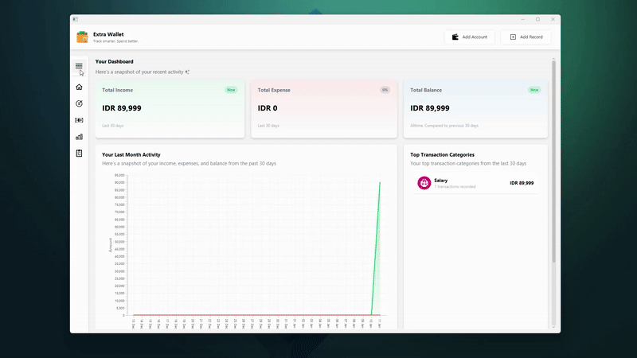

# Extra Wallet — Personal Finance App

  

**Extra Wallet** is a **personal finance desktop application** built with **Java**, managed via **Maven**, and powered by **JavaFX** for a clean and responsive GUI. All data is stored locally using **SQLite**, making the app lightweight, reliable, and fully offline.

## Overview

Take control of your finances with Extra Wallet. Designed for personal use, it provides secure local storage, insightful reporting, and a smooth desktop experience.

* **Fully Offline & Lightweight:** No server required; all data is stored locally.
* **Modern Interface:** JavaFX delivers a smooth, professional, and responsive GUI.
* **Portable & Hassle-Free:** Run the app anywhere; first launch automatically sets up your database and necessary folders.
* **Reliable Data Backup:** Export transactions to CSV for analysis, sharing, or safekeeping.
* **Smart Defaults:** Pre-loaded exchange rates and default categories help you start tracking your finances immediately.

## Core Features

* **Income & Expense Tracking:** Record transactions with precise timestamps for complete cash flow visibility.
* **Filtering & History:** Quickly filter your transactions by category, account, or date range.
* **Charts & Insights:** Visualize spending trends and financial summaries for better decision-making.
* **Budgets:** Set category-specific budgets and monitor your spending limits.
* **Currency Conversion:** Offline USD/EUR ↔ IDR conversion ensures accurate financial calculations even without internet.
* **Automatic Setup:** Creates required folders, database, and default data on first run so the app works out-of-the-box.

## Coming Soon

* Multi-account support
* Enhanced dashboard analytics
* Recurring transactions & alerts