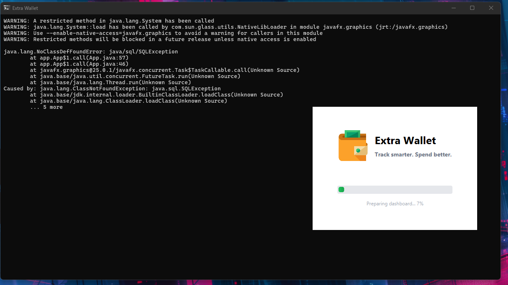

# Sytnax untuk persiapan rilis versi

1. Pastikan tidak ada error pada program, dan branch `main` sudah menerima semua commit. Bersihkan branch dengan hapus branch yang sudah di merge commit. 
2. Perbarui versi aplikasi, dengan cara masuk ke `pom.xml`, dan perbarui semantik versioning aplikasi yang akan dirilis:

    ```xml
    <version>v1.0.0</version>
    ```
    
    Dirubah menjadi, misal:
    
    ```xml
    <version>v1.5.0</version>
    ```

> [!WARNING]
> Pemberian versining dilakukan di Maven `pom.xml` file, namun settingan lain , seperti pemberian nama aplikasi, icons, dll, dilakukan melalui 'JPackage'. Pembahasanya ada dibawah!
    
Maven bertugas membangun artifact aplikasi (JAR) dan mengelola dependency secara lintas platform, sedangkan **jpackage digunakan khusus untuk membuat installer OS (EXE/MSI/DMG)** dengan konfigurasi yang sifatnya platform-spesifik.

Karena itu, properti seperti nama aplikasi, vendor, icon, dan shortcut **tidak didefinisikan di `pom.xml`**, melainkan melalui perintah atau script `jpackage` saat proses distribusi.

2. Rubah project Java keseluruhan menjadi `JAR` file dengan cara berikut:

    ```bash
    mvn clean install
    ```
   Maka akan dibuat file `JAR` di folder `target/app.jar`.

3. Konfigurasi Maven yang digunakan di `pom.xml` akan membuat 2 file JAR, satu untuk developer, dimana library tidak dibundle, dan satunya lagi adalah JAR _standalone_. JAR _standalone_ inilah yang akan kita gunakan untuk konversi ke `EXE`. File ini ditandai dengan ukuran filenya yang lebih besar daripada satunya.

4. Test apakah JAR tersebut dapat berjalan, gunakan perintah berikut:

    ```bash
    java -jar target/extrawallet-v1.0.0.jar
    ```

5. Jika aplikasi berjalan, langkah selanjutnya adalah mengkonversi ke EXE dengan menggunakan JPackage berikut.
    Bagian `--name` berisi nama aplikasi, beri tanda petik ganda `""` jika ingin menyematkan spasi diantara nama aplikasi. Lalu pada bagian `--app-version` berikan semver versi aplikasi. Cukup gunakan angka, tidak perlu menambahkan `v` didepanya, karena JPackage hanya menerima angka, lagipula format resmi versioning (SemVer): MAJOR.MINOR.PATCH. Penggunaan versioning misal dengan `v1.0.0` dilakukan dengan `git tag` 

    ```bash
    jpackage 
    --name "Extra Wallet" 
    --app-version 1.0.0
    --vendor Extra-Inc 
    --type exe 
    --input target 
    --dest target 
    --main-jar extrawallet-v1.0.0.jar 
    --main-class app.Main 
    --module-path "C:\Program Files\Java\javafx-jmods-25.0.1;C:\Program Files\Java\jdk-25.0.1\jmods" 
    --add-modules javafx.controls,javafx.fxml 
    --icon "src/main/resources/app-icon/favicon.ico" 
    --win-shortcut 
    --win-menu
    ```
    
    Atau berikut yang siap tempel di terminal (lakukan perubahan pada `--app-version` sesuai versi aplikasi):
    
    ```bash
    jpackage --name "Extra Wallet" --app-version 1.0.0 --vendor Extra-Inc --type exe --input target  --dest target --main-jar extrawallet-v1.0.0.jar --main-class app.Main --module-path "C:\Program Files\Java\javafx-jmods-25.0.1;C:\Program Files\Java\jdk-25.0.1\jmods" --add-modules javafx.controls,javafx.fxml --icon "src/main/resources/app-icon/favicon.ico" --win-shortcut --win-menu --win-console
    ```
   
## Ada beberapa error, gunakan ini untuk solusi yang sedang ditest
Pertama gunakan jlink untuk bundle semua kepertluan packaging:

```bash
jlink --module-path "C:\Program Files\Java\javafx-jmods-25.0.1;C:\Program Files\Java\jdk-25.0.1\jmods" --add-modules java.base,java.sql,java.desktop,java.logging,java.management,java.instrument,java.naming,javafx.controls,javafx.fxml,javafx.graphics,java.net.http --output my-runtime
```

dengan penggunaan jpackage sebagai berikut:

```bash
jpackage 
--name "Extra Wallet" 
--app-version 1.0.0 
--vendor Extra-Inc 
--type exe 
--input target 
--dest target 
--main-jar extrawallet-v1.0.0.jar 
--main-class app.Main 
--runtime-image my-runtime 
--java-options "--enable-native-access=javafx.graphics" 
--icon "src/main/resources/app-icon/favicon.ico" 
--win-shortcut 
--win-menu 
--win-console
```

atau berikut yang siap tempel:

```bash
jpackage --name "Extra Wallet" --app-version 1.0.0 --vendor Extra-Inc --type exe --input target --dest target --main-jar extrawallet-v1.0.0.jar --main-class app.Main --runtime-image my-runtime --java-options "--enable-native-access=javafx.graphics" --icon "src/main/resources/app-icon/favicon.ico" --win-shortcut --win-menu --win-console
```

> [!ALERT] Perhatikan bahwa disini aku menggunakan `--win-console`, ini akan dijelaskan dibagain bawah!
    
## Tips trick:
Ketka aku melakukan konversi ke JAR dengan melakukan `mvn clean install`, klik dua kali tidak akan membuka file JAR tersebut. File JAR tersebut baru bisa dibuka ketika aku menggunakan:

```bash
java -jar target/extrawallet-v1.0.0.jar
```

Jika JAR bisa dibuka dengan syntax ini, artinya JAR aman dan berhasil. Tapi jika tidak, berarti harus diperbiki lagi.

Tips kedua:
Ketika sudah dikonversi menjadi EXE, dan aku install di sistem operasi, aplikasi tersebut justru error atau crash. Error tersebut cukup klasik, yaitu adalah "_**Failed to launch JVM**_". Klasik tapi benar-beenar bikin pusing.

Akhirnya, aku menemukan beberapa masalah, yang mulai mengarah ke solusi sebagai berikut:

### 1 | Perbedaan path di intellij dengan Sistem operasi
Path yang digunakan untuk pengembangan akan sangat berbeda dengan path ketika aplikasi terpasang di aplikasi. Sehingga penggunaan path harus bisa menangai perbedaan path di tahap pengembangan dengan ketika aplikasi terpasang.

### 2 | Pesan error & feedback 
Jika aplikasi crash, sulit untuk mengetahu apa yang menyebabkanya. Mudah untuk mengetahui pesan error ketika masih di tahap pengembanagan, namun aplikasi yang sudah menjadi EXE tidak memberikan feedback. Karena aku sudah membuat banyak logger, seperti `log.info` dan `log.error` di banyak tempat di program, maka kita bisa bisa melihat feedbacknya di terminal ketika dijalankan di tahap pengembanagna, misal intelij.

Nah, ketika program dikonversi ke EXE, untuk tapah testing, gunakan tambahan atribut berupa `--win-console` pada `jpackage`, ini akan membuat aplikasi yang berjalan akan menyediakan terminal untuk mmeberikan feedback langsung:



Gambar diatas menunjukan, ketika programku crash, alias stuck, dan aku tidak tahu apa yang salah. Tapi dengan mengaktifkan `--win-console` ketika mengkonveri JAR ke EXE dengan JPackage, aku menjadi tahu bahwa ternyatta ada masalah tertentu yang harus ditangani, dan feedback ini menjadikan masalah masalah menjadi lebih jelas, tidak ambigu.

```bash
java.lang.NoClassDefFoundError: java/sql/SQLException
Caused by: java.lang.ClassNotFoundException: java.sql.SQLException
```

Itu adalah bunyi error diatas, dimana programku crash karena class JDBC / java.sql tidak ada di runtime exe aplikasiku.

### 3 | Beberapa atribut tambahan

Perhatikan pesan errror ini:

```bash
WARNING: A restricted method in java.lang.System has been called
Use --enable-native-access=javafx.graphics
```

Itu cuma peringatan, bukan crash. JavaFX native binaries (DLL) di-load lewat metode yang “restricted” → Java 20+ minta izin explicit. Solusi (opsional, untuk hilangkan warning):

```bash
--enable-native-access=javafx.graphics
```

Yaitu dengan meletakanya di argumen JPackage sebagai berikut:

```bash
jpackage ... --java-options "--enable-native-access=javafx.graphics"
```